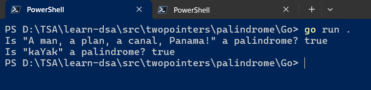
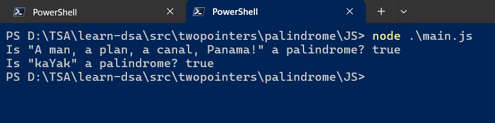

# Learn Data Structures and Algorithms

I am learning Data Structures and Algorithms from different Websites, Books, and Video courses

## 1. Big Omega (Ω)

### 1.1. Definition

> 1. Big Omega notation represents the **lower bound** on an algorithm's time complexity. It indicates the least amount of time required (best-case scenario).

### 1.2. Example

> 1. Binary search has a best-case time complexity of `Ω(log n)` because it efficiently narrows down the search space by half with each iteration.

### 1.3. JavaScript Example

```javascript
function binarySearch(arr, target) {
    let left = 0;
    let right = arr.length - 1;
    while (left <= right) {
        const mid = Math.floor((left + right) / 2);
        if (arr[mid] === target) {
            return mid; // Found at index mid
        } else if (arr[mid] < target) {
            left = mid + 1;
        } else {
            right = mid - 1;
        }
    }
    return -1; // Not found
}
```

## 2. Big Theta (Θ)

### 2.1. Definition

> 1. Big Theta notation represents the **tightest bound** on an algorithm's time complexity. It combines both the upper and lower bounds.

### 2.2. Example

> 1. Merge sort has a time complexity of `Θ(n log n)` because it consistently performs well in both best and worst cases.

### 2.3. JavaScript Example

```javascript
function mergeSort(arr) {
    if (arr.length <= 1) {
        return arr;
    }
    const mid = Math.floor(arr.length / 2);
    const left = mergeSort(arr.slice(0, mid));
    const right = mergeSort(arr.slice(mid));
    return merge(left, right);
}
function merge(left, right) {
    const result = [];
    let i = 0;
    let j = 0;
    while (i < left.length && j < right.length) {
        if (left[i] < right[j]) {
            result.push(left[i]);
            i++;
        } else {
            result.push(right[j]);
            j++;
        }
    }
    return result.concat(left.slice(i), right.slice(j));
}
```

## Time Complexity

> 1. To be done

---




